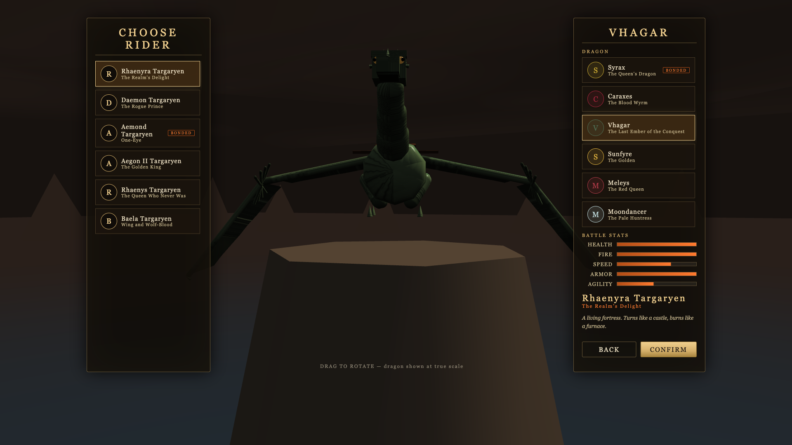
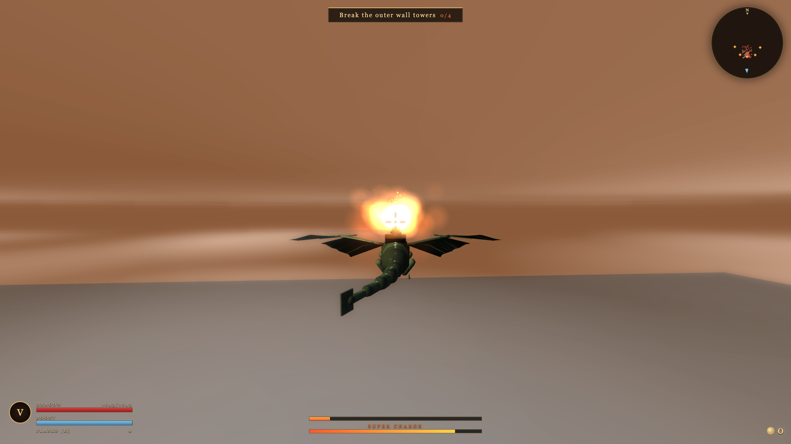
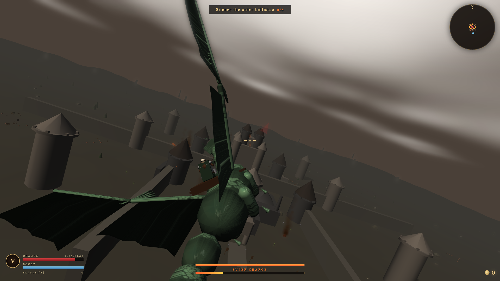
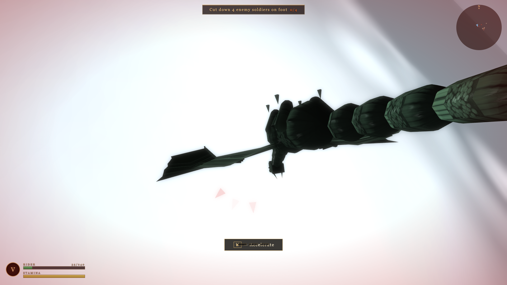

# DANCE OF FLAMES: DRAGONRIDER

A third-person 3D dragon-combat action game for the browser, inspired by the world,
factions and atmosphere of the Dance of the Dragons civil war (fan project — no
copyrighted assets; everything is procedurally generated at runtime).

Ride a dragon over a war-torn battlefield, breathe fire on armies, raze fortifications,
loot coins and hidden relics, buy upgrades — and if your dragon falls, keep fighting
on foot with a sword until the mission is done.

## Screenshots

| Dragon & rider select — Vhagar at true scale | King's Landing assault — dragonfire on the walls |
|:---:|:---:|
|  |  |

| The Blackstone Citadel — walls within walls, a keep that scratches the sky | Dragon down — the rider fights on |
|:---:|:---:|
|  |  |

## System Requirements

- **Target platform**: MacBook M1, latest Google Chrome (WebGPU renderer)
- Also runs in any Chromium browser with WebGL2 (automatic fallback)
- ~1.4 GB free disk for `node_modules`

## Node Version

Node.js 18+ (developed and verified on Node 24 LTS, npm 11).

## Installation

```bash
npm install
```

## Development Mode

```bash
npm run dev
```

Open http://localhost:5173 in Chrome.

First launch shows the main menu. `NEW CAMPAIGN` (or `BATTLE`) → pick rider & dragon →
`CONFIRM` → pick a mission + difficulty → `LAUNCH`. Every step works via
keyboard (`W/S` navigate, `Enter` select, `Esc` back) or mouse.

> The game never requires the mouse: flight, aiming, fire, target lock, ground
> combat, shops and settings are all keyboard-complete (see MANUAL in-game).

## Production Build

```bash
npm run build     # typecheck + vite build → dist/
npm run preview   # serve the production build at http://localhost:4173
```

Chrome launch for a final smoke test:

```bash
npm run build && npm run preview
open -a "Google Chrome" http://localhost:4173
```

## Controls

The game is **fully playable with the keyboard alone** — no mouse or trackpad
required for any menu or gameplay action. Mouse input remains available as an
optional alternative (mouse-look, LMB fire, RMB block). The complete guide is
in-game: **Main Menu → MANUAL** (also linked from the Pause Menu as CONTROLS).

### Menu navigation (all screens)

| Key | Action |
|-----|--------|
| `W / S` or `↑ / ↓` | Previous / next item |
| `A / D` or `← / →` | Previous / next panel or option (cycles difficulty on the mission map) |
| `Enter` / `Space` | Select |
| `Esc` | Back |

### Dragon flight (keyboard)

| Key | Action |
|-----|--------|
| `W` / `S` | Accelerate / decelerate |
| `A` / `D` | Turn dragon (bank left / right) |
| `↑ ↓ ← →` | Look / aim (smoothed virtual camera axis) |
| `Space` / `C` | Climb / descend |
| `Shift` | Boost |
| `Q` / `E` | Dodge left / right (i-frames) |
| `F` | Fire breath (hold) — or Left Mouse |
| `R` | Super Charge beam (feedback if not ready) |
| `X` | Target lock on/off (gold bracket + aim assist) |
| `Z` | Recenter camera / level flight |
| `G` | Use healing flask / consumable |
| `Tab` | Mission objectives panel |
| `Esc` | Pause |
| `F3` | Debug overlay (dev builds) |

### Rider on foot (after dragon death)

| Key | Action |
|-----|--------|
| `WASD` | Move (camera-relative) |
| `↑ ↓ ← →` | Shoulder camera |
| `J` | Light attack (3-hit combo) |
| `K` | Heavy attack (breaks shields) |
| `L` | Block / parry (tap = parry) |
| `Space` | Dodge roll (i-frames) |
| `Shift` | Sprint |
| `X` | Target lock toggle |
| `Z` | Recenter camera |
| `F` / `G` | Use healing flask |

## Game Rules

- **Mission flow**: each mission is a chain of objectives (burn troops, raze
  buildings, destroy ballistae, kill commanders, survive counterattacks).
- **Fire energy**: fire breath drains a meter (~5s continuous, ~4–7s recharge).
  After a full depletion you must recover 20% before re-igniting.
- **Super Charge**: fills from kills, destruction and time. `R` unleashes a
  devastating forward beam (13–16s cooldown by dragon).
- **Hidden relics**: specific buildings contain dragon upgrades — collected
  instantly on destruction (+15% fire damage, +30% armor, lifesteal, etc.).
- **Loot**: soldiers drop coins (magnetic pickup) and healing flasks (instant
  heal, no inventory).
- **Dragon death is not the end**: a cinematic **DRAGON FALLEN** transition
  (slow-motion, vignette, cello stinger) hands you to the rider; the mission
  converts its remaining objectives so it can always be completed on foot
  (kill squads / survive / reach victory). True **DEFEAT** occurs only when the
  rider also falls (offering RETRY / MISSION SELECT / MAIN MENU).
- **Economy**: coins persist between missions; spend them in the Armory shop
  (dragon & rider stat upgrades, consumable charges). Prices 50/120/250/500.
- **Score & ranks**: C/B/A/S based on kills, destruction, relics, damage taken,
  time, and whether your dragon survived.

## Graphics Settings

Settings → Graphics Preset:

- `LOW` — reduced particles, shadows off, 1.5× hardware scaling, 50% decorative props
- `MEDIUM` — balanced (75% props)
- `HIGH` — full quality (100% props)
- `AUTO` (default) — dynamic PerformanceGovernor adjusts render scale,
  particle budget, shadows and far-prop culling to hold 60 FPS

The minimap is **north-up** (N marker on the rim): the map stays fixed and the
player arrow rotates — A/D always turn the dragon left/right and the arrow,
enemies and landmarks agree with the world (verified by automated tests).

## Audio & Music

All audio is original and generated at runtime (see THIRD_PARTY_ASSETS.md):

- **Layered SFX** — dragon roar (sub body + formant growl + noise), size-appropriate
  wingbeats synced to the flap animation, multi-layer fire breath with ember crackle,
  speed-parameterized wind, differentiated sword impacts (armor / shield / parry),
  multi-stage building collapse, mechanical ballista fire.
- **Ambient zones** — field / village / castle crossfade by position, plus a battle
  crowd bed that follows combat intensity.
- **Adaptive soundtrack** — an original cello + violin score (menu, exploration,
  combat low/high, castle assault, ground combat, dragon-fallen stinger, victory,
  defeat) that transitions at musical bar boundaries; music ducks for major impacts.
- Volume sliders: **Master / Music / Effects** (Settings, persisted).

Also: camera-shake slider, speed-blur toggle, mouse sensitivity, invert-Y,
master/effects volume, FPS display, keyboard look speed, keyboard turn speed,
target-assist strength. Settings persist via IndexedDB.

## Architecture Overview

See [ARCHITECTURE.md](ARCHITECTURE.md). Summary: TypeScript + Vite + Babylon.js 8
(WebGPU with automatic WebGL2 fallback), pure-logic simulation modules with unit
tests, DOM-based UI (no framework owns the render loop), data-driven riders /
dragons / enemies / missions / upgrades, IndexedDB save system.

## Testing

```bash
npm run test        # 85 unit tests (vitest) — input bindings & simultaneity, combat, loot, upgrades, objectives, save, scoring, manual accuracy
npm run test:e2e    # 10 Playwright browser tests — 6 gameplay flows + console cleanliness + 3 keyboard-only suites (zero mouse input)
npm run typecheck   # strict TypeScript, zero errors
```

The E2E suite boots the real game in Chromium with a test-input API
(`?test=1`) and verifies: menu flow, kill→coin→counter, healing pickup,
building→relic→stat-up, dragon-death→ground-combat→sword kill, victory→shop
purchase, and that the console stays error-free during combat. The
**keyboard-only suites** drive every menu and the full flight + ground combat
control surface using nothing but `page.keyboard` (no `page.mouse`), proving
the MacBook keyboard-only requirement. `?keyboardOnly=1` additionally disables
mouse gameplay input for manual keyboard-purity testing.

## Performance Benchmark

```bash
npm run dev                      # in one terminal (server)
npm run benchmark                # in another — 30s scripted stress run
npm run benchmark -- mission=harrenhal seconds=20
```

Launches headed Chrome (real GPU), flies and fires automatically through the
mission, and prints: renderer, average FPS, 5th/1st percentile FPS, max frame
time, active NPC count, quality tier. Results on the reference machine are in
[PERFORMANCE.md](PERFORMANCE.md).

## Asset Licenses

All assets (3D meshes, textures, particles, UI, sounds) are **generated
procedurally at runtime** — no external art or audio files. Details:
[THIRD_PARTY_ASSETS.md](THIRD_PARTY_ASSETS.md).

## Known Limitations

- Procedural low-poly art direction (silhouette-first); the new scale-normal
  dragon materials are stylized, not photoreal
- The soundtrack is a synthesized cello/violin approximation (bowed-string
  synthesis), not recorded orchestral sampling — the cue system is structured so
  higher-quality rendered stems can replace the synth voices later
- Rider ground combat is deliberately arcade-shallow (no stamina-gated combos)
- Relic upgrades last for the current mission (architecture supports persistence)
- One save slot per browser profile
- WebGL2 fallback is fully playable but slower than WebGPU on large battles

## Credits & Legal

Fan-made battle simulator, licensed under the [PolyForm Noncommercial License 1.0.0](LICENSE)
(noncommercial use only). Not affiliated with, endorsed by, or reproducing any
asset from HBO's *House of the Dragon* or GRRM's works — rider and dragon names
are used as text data only; all art, models, and audio are original procedural
creations. Built with Babylon.js (Apache-2.0), TypeScript, Vite, WebAudio.
